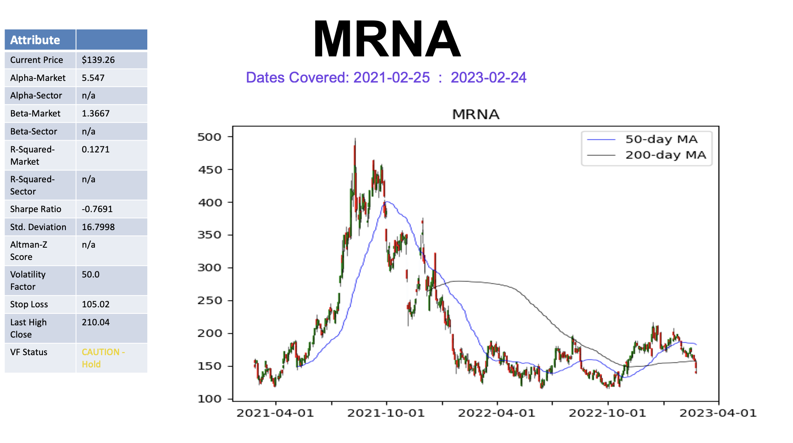
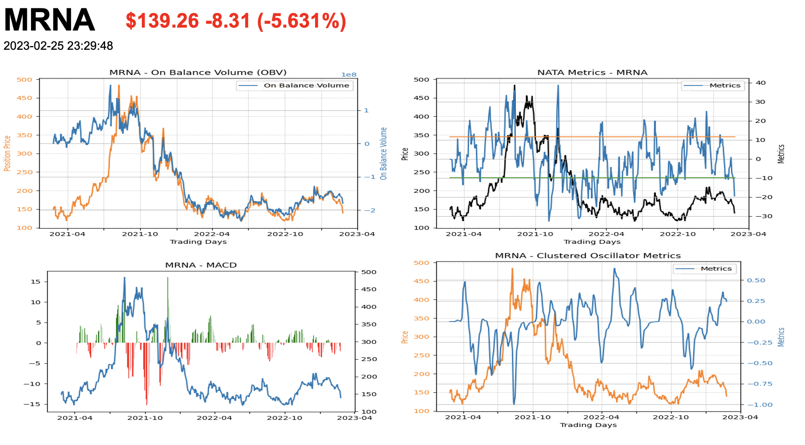

# SecuritiesAnalysisTools

Technical analysis tools app for analyzing securities (funds, stocks, bonds, equities). This app will automatically create a Powerpoint document of financial tool outputs and plots, a JSON file of the entire dataset requested, and a PDF detailing numerical metrics just by running it. Example autogenerated Powerpoint slides:


<br />

<br />
<br />
<br />

---
# Contents
* [How to Use / How to Start](#getting_started)
* [Notable Versions](#versions)
* [Acknowledgements](#acknowledgements)
* [Properties & Functions](#props_functs)
* [Installation](#installation)
* [Notable Links](#links)
* [Custom Metrics](#metrics)


---

# <a name="getting_started"></a>How to Use / How to Start

1. Pull repository, start local, virtual, and/or global python environment.
1. Run `pip install .` or `pip install '.'`.  (Validate modules installed from [_Installations_](#installations) section.)
1. Save file `core_example.json` as `core.json`. Edit new file as desired. This is recommended but not required. [Core details](#core)
    * Optional (0.1.16+) to save the `test_example.json` as `test.json` as an optional supplement to `core.json`.
    * Optional (0.2.02+) to save the `dataset_example.json` as `dataset.json` as an optional supplement to `core.json`.
1. Run `python app.py`
1. After intro screen in terminal, an input prompt with 5+ options (all followed by "enter" / "return"). Functionality described in [Properties and Functions](#props_functs):
    * Default: 'VTI' and 'S&P500' by simply hitting "enter" / "return"
    * Input tickers: any string of tickers (space-delimited) can be entered. Example: `mmm AAPL 'AMZN'`
    * "Core": starting version 0.1.02, entering `--core` when prompted for tickers will run `core.json` user funds and settings.
        * Functionality offers an update on a user's portfolio w/o requiring entering it in all of the time
    * "Test": starting version 0.1.16, entering `--test` when prompted for tickers will run `test.json` user funds and settings.
        * Functionality is the same as "core", but provides another means of configuration, especially for development.
    * "Dataset": starting version 0.2.02, entering `--dataset` when prompted for tickers will run `dataset.json` user funds and settings.
        * Functionality is the same as "core", but provides another means of configuration, especially for generating correlations.
    * "Options": starting version 0.1.13, entering `--options` will halt operation and print available input tags. (see _"Options"_ below)
    * "Functions": starting version 0.1.17, entering `--f` will allow a *function* to be run without the main service. (see *"Functions"* below)
    * "Exports": starting version 0.2.02, entering `--pptx`, `--pdf`, or `--export` will generate respective outputs using `metadata.json`
1. All default behavior (non-core) is `2 year period, 1 day interval`. (View `yfinance` api for other settings).


---

# <a name="versions"></a>Notable Versioning / Releases

* **`0.1.0`, `2019-06-04`** - Release 1: outputting to pptx and json files; basic analysis; primarily plot based
* `0.1.06`, `2019-07-13` - Wide 16:9 ratio for pptx output
* `0.1.11`, `2019-08-13` - Upgraded requirements, some better documentation, and mutual fund time frame issue resolved
* `0.1.13`, `2019-08-18` - Architecture overhaul (now `app.py`), terminal input options, error handling, robust backward compatibility to release 1
* `0.1.16`, `2019-08-23` - Data download / formatting overhaul (a `dict()` of `pd.DataFrames`); fixes `NaN` fields
* `0.1.19`, `2019-11-10` - Dataset exportation to csv, expanded `functions` capability
* `0.1.21`, `2019-12-01` - API expansion, metadata from `yfinance`
* `0.1.25`, `2020-02-08` - Start of a normalized metric across all items (oscillators covered here)
* `0.1.27`, `2020-03-09` - Multi-period data analysis ('10y', '5y', '2y', '1y'; '1d', '1w', '1m')
* `0.1.28`, `2020-03-20` - PDF export of metrics, numerical details
* **`0.2.0`, `2020-03-22`** - Release 2: Reorganization of `dev` and `prod` as functions, stable base
* `0.2.02`, `2020-05-04` - Improved Windows compatibility, PDF having latest signals
* `0.2.03`, `2020-05-08` - NASIT 'ledger' simulator (more info below) introduced
* `0.2.06`, `2020-06-19` - .pptx design completely dictated by json; `--debug` introduced to surface errors instead of try/except
* `0.2.08`, `2021-03-30` - Improved handling of short-living (<1yr) datasets; .pdf with `--debug`; locking of dependencies
* `0.2.10`, `2021-08-14` - Upped `yfinance` (bugfix) & `matplotlib` versions; switched to `setup.py` for installation.
* `0.2.11`, `2021-11-23` - Risk factor bug handling + modified metrics for low interest rates
* `0.2.12`, `2022-04-17` - Better error handling of VQ failures, notably since API is no longer available.
* `0.2.14`, `2023-01-01` - Integration of `Intellistop` (replacement for VQ)
* **`1.0.0`, `2023-02-25`** - Release 3 - the first full release
* `1.0.1`, `2023-07-19` - Upgrade to `intellistops==1.1`
* `1.0.3`, `2023-11-23` - Upgrade to `intellistops==1.2.1`; 401K analysis tools.
- `1.1.0`, 

---
# <a name="acknowledgements"></a>Acknowledgements
* [ranaroussi](https://github.com/ranaroussi/yfinance) for `PyPI yfinance` (formerly `fix-yahoo-finance`)
* M. Olberding for countless algorithm postulations, great programming discourse, contributions to this endeavor
* J. Arthur for python-pptx library
* B. Henry, V. Chevrier, J. Arthur for great discussion and theories on market behavior, technical analysis
* M. Anderson for advertising this repository as part of her speech at my wedding. :)

---
# <a name="props_functs"></a>Properties and Functions

## <a name="core"></a>"Core" Functionality

Adding `core.json` file to your repo (see 'To Use' above) can allow the user to look at any number of tickers without having to 
manually add them in to the input prompt every single time. Simply enter in `--core` when prompted to input ticker symbols and the
software will read the `core.json` file. If the file does not exist, it will run the default behavior (as if simply clicking 'enter').

Core functionality provides the user to build up a list of investments he or she owns and/or typically monitors. `core.json` is part of
gitignore, so privacy of one's funds will be maintained.

New with 0.1.16, an optional `test.json` file can be added with the same functionality and concept as `--core`. For usage, simply enter
`--test`.  This can be helpful when branching this repo and testing things separate from one's main `core.json` list. This is entirely 
optional.

New with 0.2.02, an optional `dataset.json` file can be added with the same functionality and concept as `--dataset`. For usage, simply enter `--dataset`.  This can be helpful when creating a set of stocks and/or metrics to do higher correlation data analysis and data science with while remaining separate from one's main `core.json` list. This is entirely optional.

## "Core" Properties

* **Period** - timeframe of historical stock data. Default is 2 years. (Provides 'Open', 'Close', 'High', 'Low', 'Volume', and 'Adj Close' for each fund.) Options include: 1 year, 2 years, 5 years, and 10 years.
* **Interval** - data point frequency of historical stock data. Default is 1 day. Options include: 1 day, 1 week, and 1 month.
* **Indexes** - various 'Composite' metrics that give an overall health (in terms of oscillators) of a sector or asset type. The lower the index value, the more "signifcant" the **SELL** signal; the higher the index value, the more "signifcant" the **BUY** signal.
    * `Market Composite` - summation of 'Clustered Oscillator' metrics for 11 sectors of stock market based off Vanguard's sector ETFs:
        * VHT (Healthcare), VGT (InfoTech), VNQ (Realestate), VIS (Industrial), VDE (Energy/Oil), VCR (ConsumerDiscretionary), VDC (ConsumerStaples)
        * VPU (Utilities), VAW (RawMaterials), VOX (Telcomm), and VFH (Financials)
    * `Corporate Bond` - summation of 'Clustered Oscillator' metrics for 3 corporate bond timeframes based off Vanguard's corp bond ETFs:
        * VCSH (Short-term), VCIT (Intermediate-term), and VCLT (Long-term)
    * `Treasury Bond` - summation of 'Clustered Oscillator' metrics for 4 investment-grade, treasury/gov't-based bonds and timeframes based off select Vanguard ETFs:
        * VGSH (Short-term), VGIT (Intermediate-Term), VGLT (Long-Term), and VTEB (tax-exempt municipal)
    * `International Composite` - weighted summation of 'Clustered Oscillator' metrics for 2 select Vanguard international ETFs:
        * BNDX (International Index), VWO (Emerging Markets Index)
    * `Type Composite` - grouped summation of 'Clustered Oscillator' metrics for 11 sectors grouped into the following categories:
        * Sensitive (Beta ~ 1.0, sensitive to market changes) - VGT, VOX, VIS, 50% of VDE, and 50% of VHT
        * Defensive (Beta < 1.0, slower growth but less volatile) - VDC, VPU, 50% of VHT, and 60% of VNQ
        * Cyclical (Beta > 1.0, has normal economic cycles) - VCR, VFH, VAW, 50% of VDE, and 40% of VNQ

## "Core" Exports

* **Run** - as expected, `True` if exportation to be run and `False` if to be omitted. (Can be run separately on prompt of `--export-dataset`.)
* **Fields** - optional specific fields to be exported to .csv. `fields` must be single string of keys: (e.g. `"fields": "rsi vpu macd vti"`)
    * Fields inputs should be matched to ticker symbols and  `ACCEPTED_ATTS`, listed below (2020-03-01)
        * `['statistics', 'macd', 'rsi', 'relative_strength', 'mci', 'correlation', 'futures', 'moving_average', 'swing_trade', 'obv', 'awesome', 'momentum_oscillator', 'bear_bull_power', 'total_power', 'hull_moving_average']`
        * fields are not case-sensitive (though `--export` input key _IS_ case-sensitive)
    * If ticker symbols and/or `ACCEPTED_ATTS` are left `" "` while `run = True`, then default behavior is to run all available tabular dataset of all available tickers.

## "Options" at Input

Starting with **0.1.13**, the input prompt handles varying inputs beyond simply `--core`. All of the available (and some future) options are available at the starting prompt by entering `--options`. This input will print out in the terminal available options from `resources/header_options.txt`. (Please, do not update this file as it is read only into the program.) The program will also complete after printing out the available option keys. Please run the program again with the desired `--` tags.

## "Functions" at Input

Starting with **0.1.17**, the input prompt can provide a subset of technical analysis tools to the user without having to run the entire main program and generate outputs. This subset of tools are run through the *"functions"* flag, denoted by `--f`. An advantage of this is if a user wishes to see, perhaps, only RSI and Exponential Moving Average (EMA) for securities *MMM* and *VTI*, only those will be run. Any function can be added with no limit to the number of functions added (see list of functions by running `--options`). Similarly, any number of tickers can be added with the configurable *period* and *interval* flags as well.

An example input to generate an output of an RSI, EMA, and Hull Moving Average for a 5 year window at 1 week intervals for AAPL, MMM, and VWINX would be:

`--f --rsi --ema --hull --5y --1w aapl mmm vwinx`

All plots created during the process are rendered in real time. Note: **nothing is saved in "functions" mode**. To have saved plots or data, one must run the full program and `--export`.  Any function added without the `--f` flag will not be registered as a function and could give undesired behavior.

## NASIT "Ledger" Simulator

Starting with **0.2.03**, a user can create a ledger .csv file to track prospective trades. The _ledger_ function in _functions_ reads the ledger file (`Ledger_Template.csv`), pulls the relevant data from the yfinance and SAT APIs, and creates a simulated "fund" based off the stock trades and dates. It will export a tabular .csv in `output/ledgers/` and generate a plot comparison of all ledger funds vs. the S&P500 given the particular time period of the fund.

To run this new functionality, simply run the functions below:

`--f --ledger all`

Ensure that all ledgers are in the directory specified by the path above and in the format of the template above.

---
# <a name="installations"></a>Installations
Software is designed and run on **Python 3.7 or 3.8**.

## Setup
Starting with v0.2.10, all installations will be run through `setup.py` instead of "requirements". This means that users should install this package accordingly:

```bash
# For normal use of this software, install with the .
pip install .

# For developer use (in the event of forking this repo), use the .[dev] installation to gain developer libraries
pip install .[dev]
```

For `zsh` terminal users (and some MacOSX users), use the `''` notation:
```bash
# For normal use of this software, install with the .
pip install '.'

# For developer use (in the event of forking this repo), use the .[dev] installation to gain developer libraries
pip install '.[dev]'
```

For users who have v0.2.09 or earlier installed, it is recommended that you remove the virtual environment that hold the installed requirements for this repo and create a new, fresh virtual environment. Once created, install using the `setup.py` installation instructions above.

For users who have a version installed that is v0.2.10 or higher and wish to install the latest version, it is recommended to do an uninstall first then a fresh install. (Note that the user may have to use the `''` notation for `zsh`, etc.):

```bash
pip uninstall SecuritiesAnalysisTools
pip install .
```

### If Issues in Installing Above
You can alternatively install certain packages as below, though the `setup.py` file should take care of it.

Run `pip install yfinance --upgrade --no-cache-dir` (note: 'upgrade' and 'no-cache...' might be omitted)
Run `pip install python-pptx`

### Matplotlib & OSX errors
Note: this **issue has been resolved** with `matplotlib==3.0.2`. As of v0.2.10, this software requires `matplotlib==3.3.3` accordingly, so there should be no issue anymore.

If `matplotlib.backend` has issues with OSX, try running `conda install matplotlib` to solve issue.

If that does not solve issue, see [StackOverFlow Solution](https://stackoverflow.com/questions/21784641/installation-issue-with-matplotlib-python) for other ways of solving issue.
Other solutions, employed on all plotting functions, is the `register_matplotlib_converters()` function call preceding all plotting code at the beginning of each function. This is currently implemented in this software.


---

# <a name="links"></a>Notable links:

[Yahoo Finance Python](https://pypi.org/project/yfinance/)<br />
[Top 4 Tech Tools](https://www.investopedia.com/articles/active-trading/041814/four-most-commonlyused-indicators-trend-trading.asp) <br />
[Tip Ranks, Metadata](https://www.tipranks.com/) <br />
[TradingView - Awesome Charts](https://www.tradingview.com/) <br />

---

# <a name="metrics"></a>Custom Metrics

* _Clustered Oscillators_ - weighted-aggregate of RSI, Stochastic, and Ultimate Oscillators. **Higher: buy, lower: sell**
* _Swing Trades_ - logic to create an oscillator signal using various moving averages. **Higher: buy, lower: sell**
* _Market Composite Index (MCI)_ - equal weight aggregate of all 11 market sectors of clustered oscillators
* _"X" Bond Composite Index (BCI)_ - similar to MCI except where *"X"* is *Treasury*, *Corporate*, or *International*. All three supported.
* _Correlation Composite Index (CCI)_ - mapping of various lookback periods of correlations of 11 sectors with S&P500.
* _Type Composite Index (TCI)_ - weighted indexes representing *Sensitive*, *Defensive*, and *Cyclical* stock sectors
* _NATA Metric_ - summation of all metrics of all technical analysis tools available.
